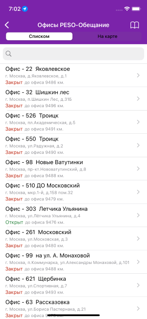
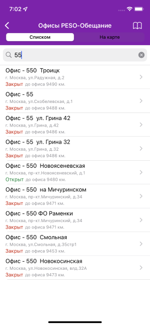
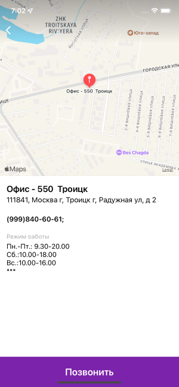

# PESO - тестовое задание по iOS #

## Задание:
### Разработать приложение под мобильную платформу iOS с тремя экранами (Рис. 1 - Рис. 3)

### Алгоритм работы приложения:
1. При запуске приложения появляется экран c кнопкой «Получить список
офисов» (Рис. 1).
2. Нажатие на кнопку «Получить список офисов» приводит к получению данных с
сервера и переходу на экран с табличным представлением полученных данных
(Рис. 2).
3. Нажатие на любую ячейку из списка офисов (Рис. 2) приводит к переходу на
экран с подробной информации по выбранному офису (Рис. 3).

### Требования к реализации приложения:
1. Приложение должно быть совместимо с **iOS 11.0** и выше.
2. В приложении реализовать обработку ошибок при выполнении сетевого запроса,
при получении ошибки выводить текстовое сообщение пользователю с помощью
`UIAlertController` со следующими параметрами:
`title = «Ошибка», message = error.description`
3. Дизайн экранов должен максимально соответствовать (Рис. 1 - Рис. 3).
4. При проектировании использовать только верстку кодом. Не использовать
storyboard, не использовать дополнительные библиотеки, кроме Foundation, UIKit.
5. `UISegmentControl` должен присутствовать (Рис. 2), представление «На карте» реализовывать не надо
6. Реализовать функционал строки поиска.
7. Элемент отображающий **статус офиса - открыт/закрыт**, определять с
учетом часового пояса пользователя и информации о часах работы из полученного
JSON.
8. Расстояние до офиса вычислять путем сравнения текущих координат
пользователя и координат офиса.
офиса.
9. При реализации элементов дизайна необходимо учесть пропорции для разных
диагоналей телефонов. Адаптировать размер текста, отступы и перенос строки
внутри элементов пользовательского интерфейса.
10. Приложение должно поддерживать только портретный режим ориентации
устройства.
11. Соблюдать цветовую гамму элементов пользовательского интерфейса согласно
представленным образцам.
12. Соответствие цветов приложения реализовать только в светлой теме, темную
тему реализовать не требуется.

# Итог работы:

